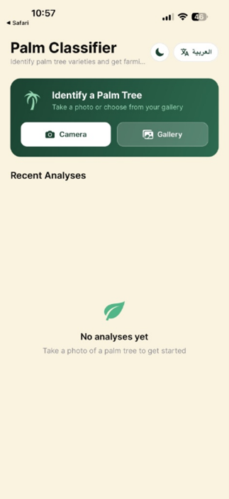
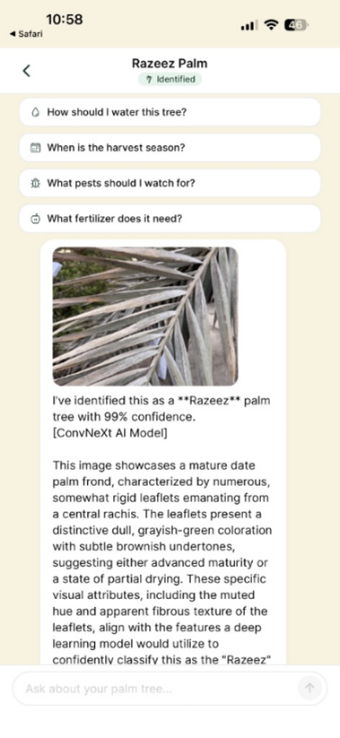
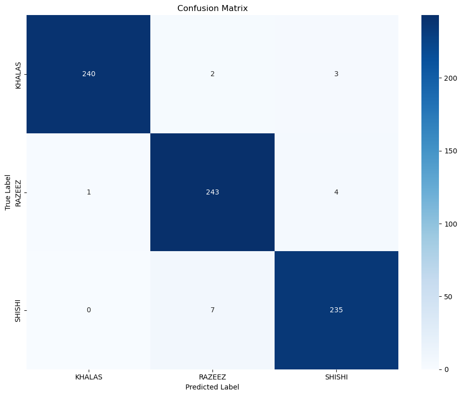

# Semantic AI Framework for Palm Tree Variety Classification

## About the Project
This project is a Semantic AI Framework designed to classify palm tree varieties (specifically Khalas, Razeez, and Shishi) and provide an interactive, knowledge-retrieval digital assistant for agricultural insights. By bridging the gap between traditional farming practices and modern artificial intelligence, this framework serves as a reliable, accessible tool for farmers and agricultural enthusiasts.

## Application Previews & Model Results

Below is a look at the application in action and the performance of our underlying AI model:

**1. Real-Time Image Classification**

*The cross-platform mobile application allows users to upload or capture images of palm trees for instant analysis. In the example above, the backend AI inference server successfully identifies the 'Khalas' variety with a high confidence score.*

**2. RAG-Powered Agricultural Chatbot**

*Beyond visual classification, the app features a Retrieval-Augmented Generation (RAG) chat assistant to address the agricultural knowledge gap. Farmers can ask complex questions—such as inquiries about "bunch bagging" (تكميم العذوق)—and receive detailed, context-aware answers generated from a specialized database of agricultural documents.*

**3. Model Performance (Confusion Matrix)**

*Our custom ensemble of ConvNeXt-Small models demonstrated exceptional reliability. The confusion matrix above illustrates the high accuracy and minimal misclassification achieved across all three test classes (Khalas, Razeez, and Shishi) during our final testing phase.*

## How We Built It
The system is divided into a cross-platform mobile application, a Retrieval-Augmented Generation (RAG) backend, and a dedicated AI inference server, ensuring a clean separation of operations. 
* **Frontend:** Built using React Native and Expo for a seamless, responsive user experience on both Android and iOS devices.
* **Backend & RAG Engine:** Developed with Node.js and TypeScript. The RAG engine utilizes a hybrid retrieval system (combining keyword matching and semantic embeddings) alongside the Gemini GenAI model to parse queries and generate accurate agricultural advice.
* **AI Server:** Hosted using Python, Flask, and PyTorch to efficiently process uploaded images and run the heavy classification logic completely independent of the main backend.

## Model Training 
To ensure highly accurate and robust image classification across varying environmental conditions, we developed a custom Deep Learning pipeline:
* **Architecture:** We utilized the ConvNeXt-Small (ConvNeXt-S) architecture.
* **Training Techniques:** The model was trained using 5-Fold Cross Validation, MixUp Data Augmentation (alpha=0.4), and Differential Learning Rates to reduce overfitting and significantly improve generalization.
* **Inference Strategy & Results:** During testing, we applied Test Time Augmentation (TTA). The final prediction is generated by an advanced ensemble method that averages the outputs of 30 distinct fold-files, maximizing prediction confidence and overall classification accuracy on farm data.

*For a detailed look at the exploratory data analysis, the training loop, and the final evaluation metrics, please refer to the `Palmtree_CNN_Model.ipynb` file included in this repository.*

## Dataset Access Request
The specialized dataset of palm tree images (Khalas, Razeez, and Shishi) and the curated agricultural documents used to train and validate this framework are private. **If you wish to access the dataset to replicate our results or conduct further academic research, you must directly contact the project supervisor or the College of Computer Sciences & Information Technology at King Faisal University.**

## Contributors
This project was collaboratively developed by:
* Abdullah Mohammad Alhasawi
* Anas Al-Jumaiah
* Ibrahim Alborsias
* Khalid Sami Almuhaysh

**Supervision:**
* **Project Supervisor:** Dr. Abdulelah Abdullah Algosaibi
* **Committee Members:** Mohamed Shujah Sameem and Abdul Raouf Mohammad

## Legal and Academic Disclaimer
This software and its associated research were developed and submitted in partial fulfillment of the requirements for the degree of Bachelor of Science in Computer Science at the **College of Computer Sciences & Information Technology, King Faisal University**, in Al-Ahsa, Saudi Arabia. 

The intellectual property, architecture, and findings of this project are the academic output of the student contributors and the supervising faculty. This repository and its code are provided strictly for academic review and portfolio demonstration purposes. The codebase, models, and UI designs may not be deployed for commercial use, modified for resale, redistributed, or claimed as original work by unaffiliated third parties without explicit written consent from King Faisal University and the original authors.
